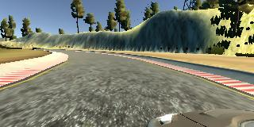
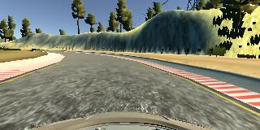
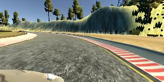

# Behavioral Cloning Project

Overview
---

In this project, I  deep neural networks and convolutional neural networks to clone driving behavior.The model will output a steering angle to an autonomous vehicle.

Using a simulator I can steer a car around a track for data collection. Image data and steering angles used to train a neural network and then use this model to drive the car autonomously around the track.

The Project
---
The goals / steps of this project are the following:
* Use the simulator to collect data of good driving behavior 
* Design, train and validate a model that predicts a steering angle from image data
* Use the model to drive the vehicle autonomously around the first track in the simulator. The vehicle should remain on the road for an entire loop around the track.
* Summarize the results with a written report

### Dependencies
This project requires **Python 3.5** and the following Python libraries installed:
- [Keras](https://keras.io/)
- [NumPy](http://www.numpy.org/)
- [Matplotlib](http://matplotlib.org/) 

### Data : 
I used the data which was provided with the project. The simulator at a given time step  recordes three images taken from left, center, and right cameras. The following figure shows an examples : 

Left| Center | Right
----|--------|-------
 |  | 

### Model Architecture and Training Strategy

#### 1-Normalization:
In Keras, lambda layers can be used to create arbitrary functions that operate on each image as it passes through the layer. So i used it to normalize the data.

#### 2-Cropping Images:
Not all of images pixels contain useful information, the top portion of the image captures trees and hills and sky, and the bottom portion of the image captures the hood of the car. So it is better to crop these parts.
Keras provides the Cropping2D layer for image cropping within the model.

#### 3. Convolution Neural Network and Activation Function : 

My model consists of a convolution neural network with 5x5 filter sizes.The model includes RELU layers to introduce nonlinearity. 

#### 4. Attempts to reduce overfitting in the model

The model was trained and validated on different data sets to ensure that the model was not overfitting and I used the early stoping method to avoid overfitting . The model was tested by running it through the simulator and ensuring that the vehicle could stay on the track.

#### 5. Model parameter tuning

The model used an adam optimizer, so the learning rate was not tuned manually.

#### 6. Solution Design Approach

My Architecture is  similar to the LeNet.

In order to gauge how well the model was working, I split my image and steering angle data into a training and validation set.

The final step was to run the simulator to see how well the car was driving around track one. the vehicle is able to drive autonomously around the track without leaving the road.

####  My final model architecture : 

My final model consisted of the following layers:

| Layer         		|     Description	        					| 
|:---------------------:|:---------------------------------------------:| 
| Input         		| 160x320x3 RGB image   			    		| 
| Lambda     	        | Normalization                                 |
| Cropping2D          	| 70 from top & 25 from bottom                  |
| Convolution 5x5     	| 1x1 stride                                    |
| Max pooling	      	| 2x2 stride                    		       	|
| RELU					|   Activation Function							|
| Convolution 5x5     	| 1x1 stride                                 	|
| Max pooling	      	| 2x2 stride                     		       	|
| RELU					|   Activation Function							|
|	Flatten				|		            							|
|	Fully connected		|		output 128								|
|	RELU     			|		Activation Function			  	    	|
| Fully connected		|       output 84       		     			|
|	RELU     			|		Activation Function			  	    	|
|	Fully connected		|				output 1						|